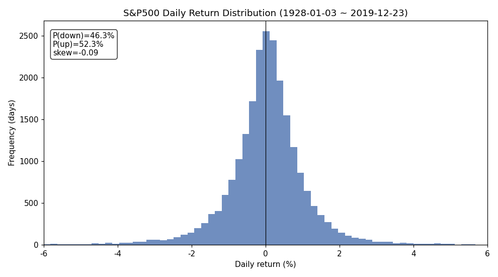
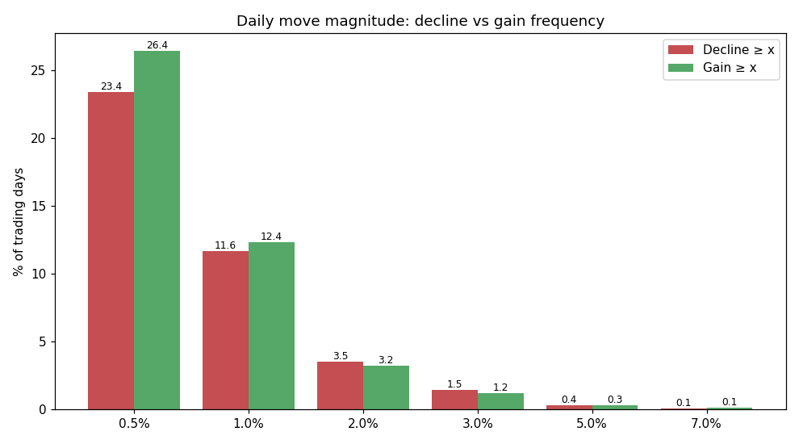
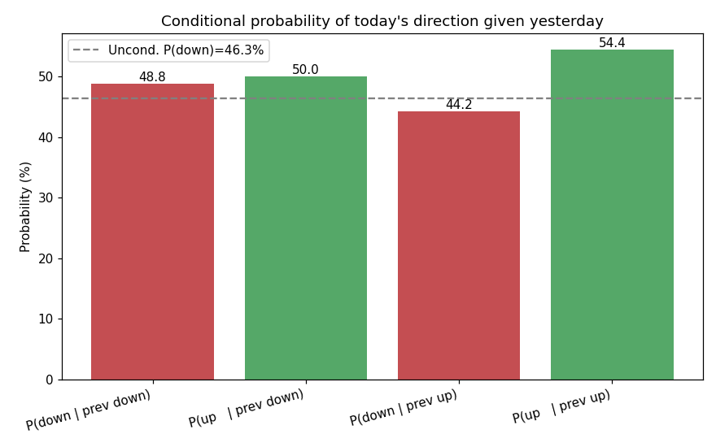
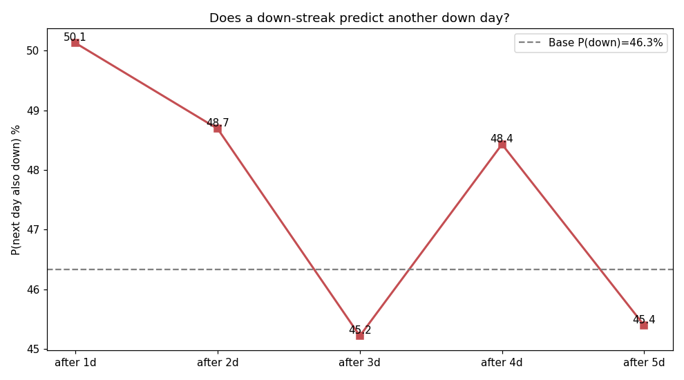
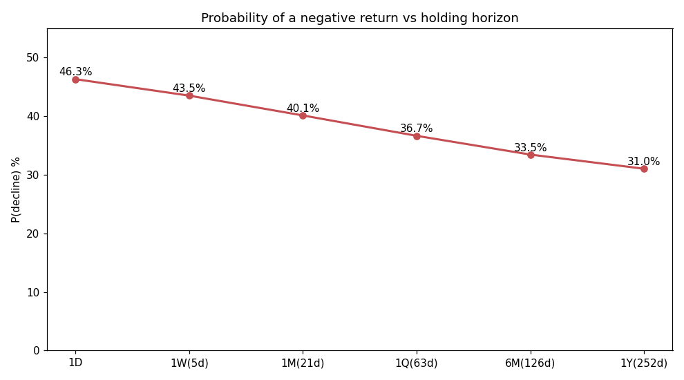
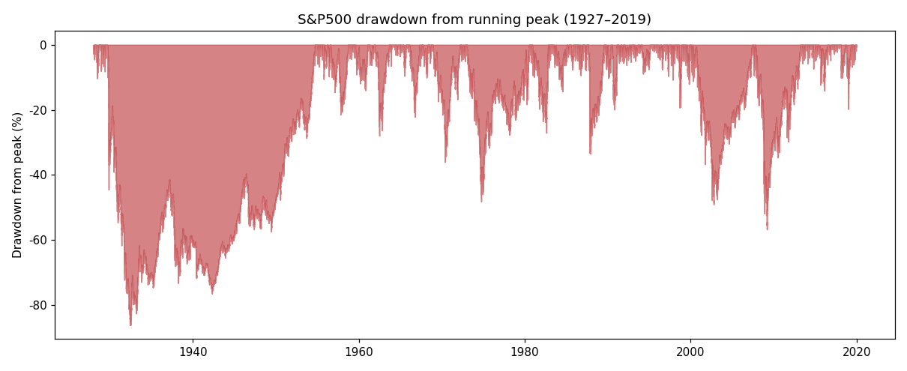
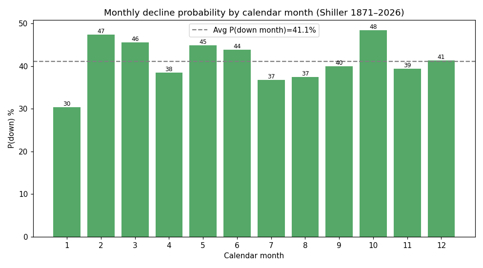
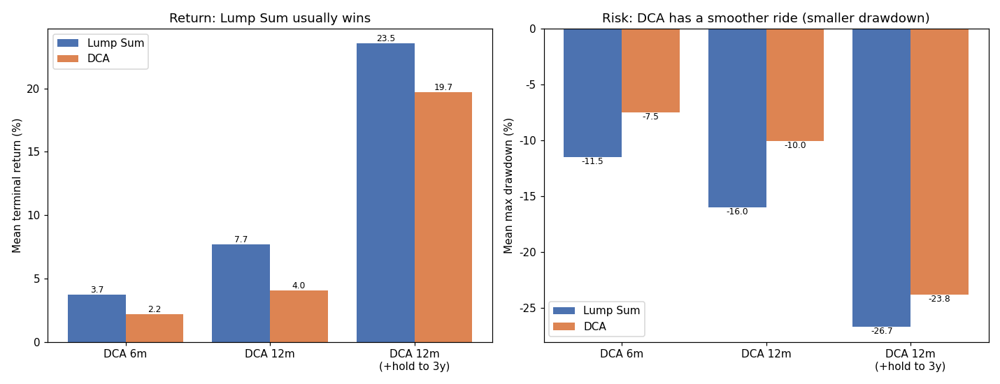

# 美股下跌概率与涨跌关联分析报告

> 标的：标普 500 指数（S&P 500）
> 日线样本：1928-01-03 ~ 2019-12-23，共 **23,103** 个交易日（约 92 年，含 1929、1987、2000、2008 四次大崩盘）
> 月度样本：1871-02 ~ 2026-05，共 **1,864** 个月、**155** 个完整年度（Robert Shiller 数据，覆盖 2020 新冠、2022 熊市等近期事件）
> 全部数字由 `analyze.py` 直接从原始价格序列计算，可复现；结果见 `results.json`，图表见 `figures/`。

---

## 一、核心结论（TL;DR）

1. **单日基本是「抛硬币」**：任意一天下跌概率 **46.3%**、上涨 **52.3%**、收平 1.4%。上涨日略多于下跌日，但每个下跌日的平均跌幅（-0.78%）**略大于**上涨日的平均涨幅（+0.75%）——「涨慢跌快」的负偏特征。
2. **持有越久，亏损概率越低**：1 天亏损概率 46%，1 个月降到 40%，1 年降到 **31%**，这正是「时间是股市朋友」的统计来源。
3. **涨跌之间几乎不存在可交易的「方向记忆」**：日收益 lag-1 自相关仅 **-0.001**，方向自相关 +0.045，趋近于 0。**昨天跌 ≠ 今天更会跌**（P(今跌|昨跌)=48.8%，仅比无条件的 46.3% 高 2.5 个百分点）。
4. **真正强相关的不是「方向」而是「幅度」**：|收益| 的 lag-1 自相关高达 **0.32**——这就是**波动率聚集**：大波动后面大概率还是大波动，恐慌与平静都会成串出现。
5. **下跌是常态背景**：历史上 **94.7%** 的时间股价都低于前期高点，**54%** 的时间处于 ≥10% 的回撤（修正）中，**39%** 的时间处于 ≥20% 的回撤（熊市）中。

---

## 二、单日下跌概率与跌幅分布



| 指标 | 数值 |
|---|---|
| P(下跌) | **46.33%** |
| P(上涨) | 52.32% |
| P(收平) | 1.36% |
| 日均收益 | +0.0296% |
| 日收益标准差 | 1.185% |
| 上涨日平均涨幅 | +0.751% |
| 下跌日平均跌幅 | **-0.784%** |
| 偏度 (skew) | -0.092（轻微负偏） |
| 超额峰度 (kurtosis) | **+17.5**（极度肥尾） |
| 史上最差单日 | **-20.47%**（1987-10-19 黑色星期一） |
| 史上最好单日 | +16.61%（1933-03-15） |

**跌幅阈值的发生频率**（理解「极端下跌有多罕见」）：



| 单日跌幅 ≥ | 概率 | 平均多久发生一次 |
|---|---|---|
| 0.5% | 23.4% | 约 4 个交易日 |
| 1% | 11.6% | 约 9 个交易日（≈ 两周一次） |
| 2% | 3.5% | 约 28 个交易日（≈ 一个半月一次） |
| 3% | 1.46% | 约 69 个交易日（≈ 一个季度一次） |
| 5% | 0.35% | 约 285 个交易日（≈ 一年多一次） |
| 7% | 0.11% | 约 924 个交易日（≈ 三年半一次） |

> **肥尾警告**：若收益服从正态分布，-5% 这种单日应几千年才出现一次；实际却平均每年都来一次。超额峰度 17.5 说明极端事件远比「钟形曲线」频繁——这是风控中**绝不能用正态分布低估尾部风险**的实证依据。

---

## 三、涨跌关联：方向几乎独立，幅度高度聚集

这是本次调研的重点——「涨跌关联数字」。

### 3.1 方向几乎没有记忆（弱有效市场的证据）

| 关联指标 | lag1 | lag2 | lag3 | lag4 | lag5 |
|---|---|---|---|---|---|
| 收益率自相关 | **-0.0013** | -0.0278 | +0.0014 | +0.0057 | -0.0026 |
| 方向(符号)自相关 | +0.0449 | -0.0264 | -0.0154 | +0.0167 | +0.0061 |

全部趋近 0。换句话说，**用「昨天涨跌」预测「今天涨跌」几乎没有信息量**。

### 3.2 条件概率表



| 条件 | 今天的概率 |
|---|---|
| P(今跌 \| 昨跌) | 48.8% |
| P(今涨 \| 昨跌) | 50.0% |
| P(今跌 \| 昨涨) | 44.2% |
| P(今涨 \| 昨涨) | **54.4%** |

- 无条件 P(跌)=46.3%。昨跌→今跌的 **lift = 1.05**，即只比随机高 5%，统计上接近独立。
- 唯一略明显的是「**昨涨→今涨 54.4%**」的轻微动量，但幅度太小，扣掉交易成本不具可交易性。

### 3.3 连涨连跌（streak）会自我延续吗？——不会



| 已经连跌 | 次日继续跌的概率 |
|---|---|
| 1 天 | 50.1% |
| 2 天 | 48.7% |
| 3 天 | 45.2% |
| 4 天 | 48.4% |
| 5 天 | 45.4% |

无论已经连跌几天，次日继续跌的概率都在 **45%~50%** 之间徘徊，**没有「越跌越要跌」也没有明显「跌多必反弹」**。
- 平均连跌长度 1.95 天（最长 12 天）；平均连涨长度 2.19 天（最长 14 天）——连涨略长，与长期上行漂移一致。

### 3.4 真正强的关联：波动率聚集

| 指标 | 数值 | 含义 |
|---|---|---|
| **\|收益\| 的 lag-1 自相关** | **0.316** | 大波动后大概率还是大波动 |
| 大跌（≤-2%）次日平均收益 | +0.162% | 大跌后次日**平均反弹**（但方差极大） |
| 大涨（≥2%）次日平均收益 | +0.089% | 大涨后次日也偏正 |

**关键洞察**：股市里「能被预测」的不是**方向**，而是**风险（幅度）**。方向接近随机游走，但波动率有很强的持续性——这是 GARCH 类模型、以及「危机会成串爆发」的统计根源。投资上的含义是：**择时（猜涨跌）极难，管理仓位/风险（应对波动）才是可行的**。

---

## 四、持有期越长，亏损概率越低



| 持有期 | P(亏损) | 平均收益 | 5% 分位（坏情形） | 95% 分位（好情形） |
|---|---|---|---|---|
| 1 天 | 46.3% | +0.03% | -1.67% | +1.65% |
| 1 周 | 43.5% | +0.15% | -3.88% | +3.71% |
| 1 月 | 40.1% | +0.62% | -7.62% | +7.73% |
| 1 季 | 36.7% | +1.88% | -13.6% | +14.4% |
| 半年 | 33.5% | +3.73% | -19.1% | +23.1% |
| **1 年** | **31.0%** | +7.68% | -25.6% | +37.7% |

正的日均漂移（+0.03%/天）随时间累积，把胜率从硬币级别的 46% 抬升到 1 年期的 69%。但注意分位数：1 年期的「坏情形（5 分位）」仍可亏 -26%，**长期向上 ≠ 没有大幅回撤风险**。

---

## 五、回撤、修正与熊市的时间占比



| 指标 | 数值 |
|---|---|
| 史上最大回撤 | **-86.2%**（1932-06 大萧条谷底） |
| 处于「修正」（≥10% 回撤）的时间占比 | **54.1%** |
| 处于「熊市」（≥20% 回撤）的时间占比 | **38.8%** |
| 距前高 5% 以内的时间占比 | 34.3% |
| 低于前期高点的时间占比 | **94.7%** |

> 直觉颠覆：人们以为「创新高」是常态，实际上股指**绝大多数日子都在从某个高点回撤的途中**。能长期持有的前提，是先在心理与仓位上接受「一半时间都在 -10% 以上的回撤里」。

---

## 六、月度与年度下跌概率（1871–2026，含近期）

| 指标 | 数值 |
|---|---|
| P(月度下跌) | **41.15%** | 
| 月均收益 | +0.48% |
| P(年度下跌) | **34.19%**（即约 **2/3 的年份上涨**） |
| 年均收益（价格） | +6.4% |
| 最差年份 | 1931 年 **-45.6%** |
| 最好年份 | 1933 年 +46.2% |
| 月度方向自相关 lag1 | +0.274（比日线强，存在中期动量） |
| P(本月跌 \| 上月跌) | 50.3% |

### 日历月季节性（哪个月最容易跌？）



各日历月的下跌概率（红=高于平均，绿=低于平均）：

| 月份 | 1 | 2 | 3 | 4 | 5 | 6 | 7 | 8 | 9 | 10 | 11 | 12 |
|---|---|---|---|---|---|---|---|---|---|---|---|---|
| P(跌)% | 30.3 | 47.4 | 45.5 | 38.5 | 44.9 | 43.9 | 36.8 | 37.4 | 40.0 | **48.4** | 39.4 | 41.3 |

- **最易跌：2 月、10 月、3 月、5 月**（"Sell in May" 与 9-10 月的恐慌季有一定实证支持）。
- **最不易跌：1 月、7 月、8 月**（"一月效应"、夏季偏强）。
- 注意：月度自相关达 +0.27，说明**中期（月级别）存在一定动量**，与日级别的「近乎独立」形成对比——这也是为什么动量策略多在月度而非日度上构建。

---

## 七、加仓时机实战：现在加 vs 等暴跌 vs 定投

前六章描述「下跌长什么样」，本章回答最实际的问题：**手上有钱该怎么投？** 三个脚本（`dip_buying.py` / `verify.py` / `dca_vs_lumpsum.py`）给出可复现的回测。

### 7.1 跌得越多，未来回报越高吗？——几乎不是

按「当前距前高的回撤深度」分桶，看未来 **1 年** 回报（日线 1928–2019）：

| 当前状态 | 1 年后平均 | 胜率 | 最差 |
|---|---|---|---|
| 前高附近（回撤<5%） | +7.7% | 69.9% | -44.7% |
| 回撤 10–20% | +8.1% | 69.7% | -48.8% |
| 回撤 20–30% | +8.5% | **78.7%** | -50.2% |
| 回撤 >30%（深熊） | +7.6% | 63.9% | **-71.1%** |

无论在前高附近还是深熊里买，未来一年预期回报都是 **+7~8%、胜率 64~79%**，差别很小；**「等更深的跌」并不会系统性提高回报**，深熊的尾部反而最惨（你不知道是不是 2008/1931 那种还要再腰斩）。

### 7.2 现在就买 vs 持币等回调 X% 再买

3 年窗口、每月一个起点、未投现金按 0/2/4/6% 年化计息（`verify.py` 跨子区间复算）：

| 策略 | 平均终值收益（全样本，现金 6%） | 备注 |
|---|---|---|
| **立即投资** | **+23.5%** | — |
| 等回调 10% 再买 | +20.7% | 全样本 ~10% 的窗口 3 年内没等到 |
| 等回调 20% 再买 | +20.4% | 全样本 ~47% 的窗口 3 年内没等到（被迫长期空仓） |

**稳健性结论**（战后 / 现代 / 剔除大萧条均复算）：

- **平均回报：立即投资在每一个子区间、每一档现金利率下都胜出**——这条很稳。
- **但单窗口胜率要诚实**：给现金计 4–6% 利息后，等一个**浅回调（10%）**实际有 53–61% 的窗口跑赢立即投资——「经常小赢、偶尔大输（踏空大涨）」，所以均值仍输。
- **等深回调（20%+）持币空仓明显更差**：高踏空率把均值拖垮，现代样本 71% 的窗口 3 年都等不到。

> 一句话：**别为了等一次 20%+ 暴跌而持币空仓**（经得起所有检验）；若已有计息闲钱，「立即投」和「留一部分等 10% 级别回调补」差别不大，属个人偏好。

### 7.3 一次性投入 vs 定投（DCA）

总资金=1，一次性=第 0 天全投；定投=K 个月每月投 1/K；同一终点比较终值，并测累积期内最大回撤（`dca_vs_lumpsum.py`）：



| 配置 | 一次性均值 | 定投均值 | 一次性跑赢比例 | 一次性平均回撤 | 定投平均回撤 |
|---|---|---|---|---|---|
| 定投 6 个月 | +3.7% | +2.2% | 63.5% | -11.5% | **-7.5%** |
| 定投 12 个月 | +7.7% | +4.0% | 67.3% | -16.0% | **-10.0%** |
| 投完持有到 3 年 | +23.5% | +19.7% | 66.9% | -26.7% | -23.8% |

- **收益**：约 **2/3 的起点一次性投入终值更高**（与经典 Vanguard 研究一致），因为市场多数时间上涨，定投让钱晚入场、踏空上涨。
- **风险**：**定投把累积期最大回撤砍掉约 1/4–1/3**（建仓期里有一部分仍是现金，少暴露于下跌），最差情形也更温和（12 个月：-71% → -53%）。
- **现金计息后差距收窄**：12 个月定投在现金 4% 时，收益劣势从 3.6pp 缩到 1.8pp。

> **DCA 不是「赚更多」的策略，而是用一点期望收益（约 1.5–3.6pp/年）换取显著更小的回撤（少 4–6pp）和「不会一把买在最高点」的安心**——它管理的是人性与时机风险。

### 7.4 落地建议

| 你的情况 | 倾向 |
|---|---|
| 追求期望收益最大化、扛得住浮亏、钱是长期闲钱 | **一次性投入** |
| 在意回撤/后悔、怕刚投完就大跌 | **定投（6–12 个月分批）** |
| 想「逢跌补仓」 | 用**已有的计息现金储备**顺势补，而**不是**卖出持仓/停止定投去空仓等跌 |
| 最该避免 | **持币空仓等一次 20%+ 暴跌**（回测中最差，常年等不到） |

---

## 八、方法论与局限

- **指标含义**：「下跌概率」= 价格收益 < 0 的频率（未含股息，含股息会进一步抬高上涨概率）。
- **样本拼接**：日线分析用 1928–2019（Yahoo 源），月度/年度用 Shiller 1871–2026。日线未覆盖 2020 新冠闪崩与 2022 熊市，但 92 年、含四次大崩盘的样本对**日频频率/自相关**已足够稳健（这些一阶矩在各时代高度稳定）；近期极端事件已通过月度样本纳入年度统计。
- **历史 ≠ 未来**：所有概率为历史频率的频率派估计，非对未来的预测；尾部（峰度 17.5）意味着真实风险常被低估。
- **加仓回测的口径**：窗口按月重叠采样、样本不独立，「胜率%」误差区间较大，属描述性而非统计推断；价格未含股息，计入股息会进一步偏向「尽早在市」；现金计息为简化常数假设。
- **不构成投资建议**。

## 复现方式

```bash
pip install numpy pandas matplotlib
python3 analyze.py           # 第1-6章: 下跌概率/分布/涨跌关联/回撤/季节性 -> figures/ + results.json
python3 dip_buying.py        # 7.1-7.2: 按回撤分桶的前瞻回报 + 现在买 vs 等回调
python3 verify.py            # 7.2: 跨子区间 + 现金计息的稳健性验证
python3 dca_vs_lumpsum.py    # 7.3: 一次性 vs 定投(DCA) -> figures/fig8
```

数据来源：
- 日线：[fja05680/dow-sp500-100-years](https://github.com/fja05680/dow-sp500-100-years)（源自 Yahoo Finance）
- 月度：[datasets/s-and-p-500](https://github.com/datasets/s-and-p-500)（Robert Shiller）
